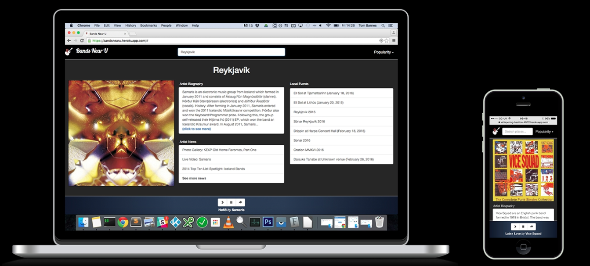
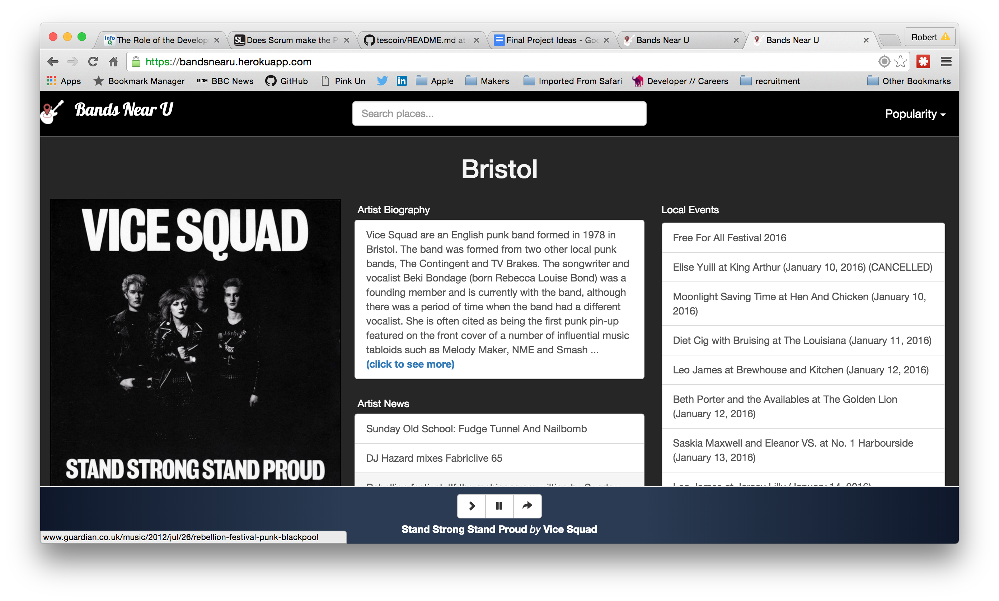
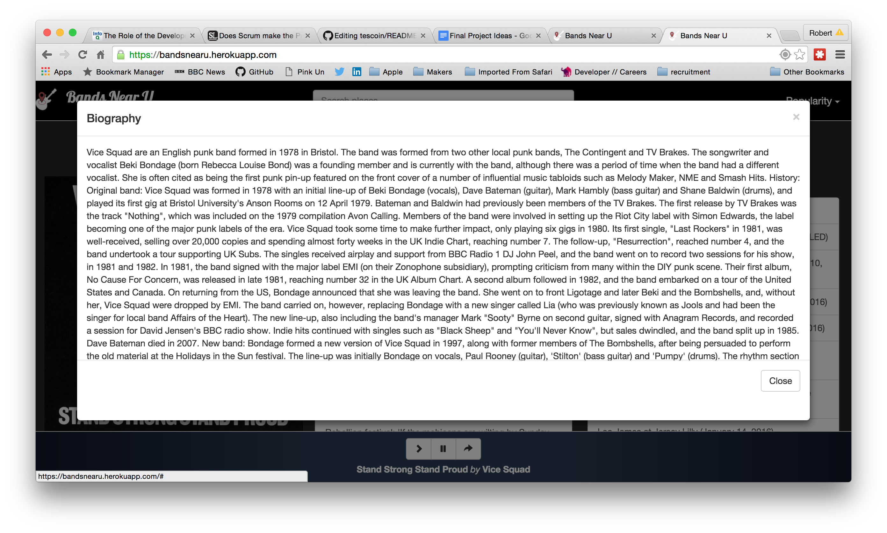
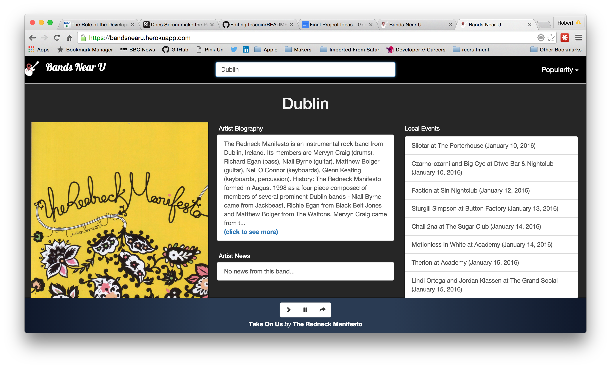
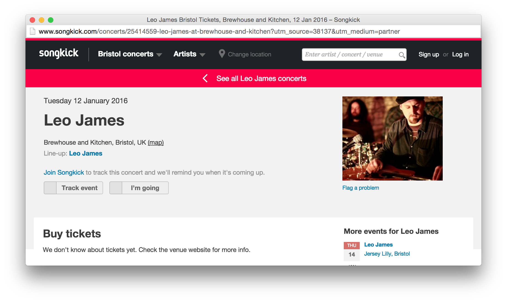
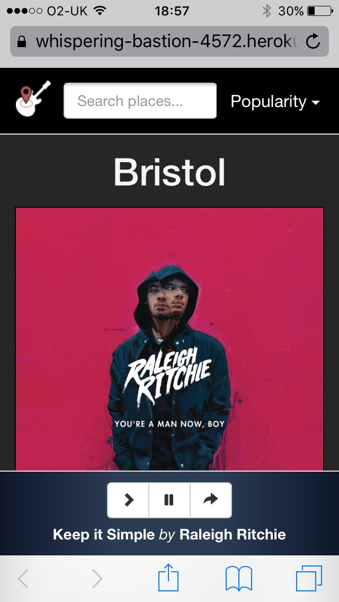
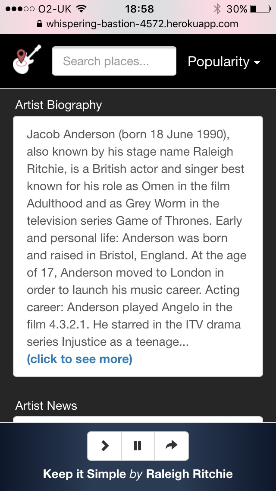
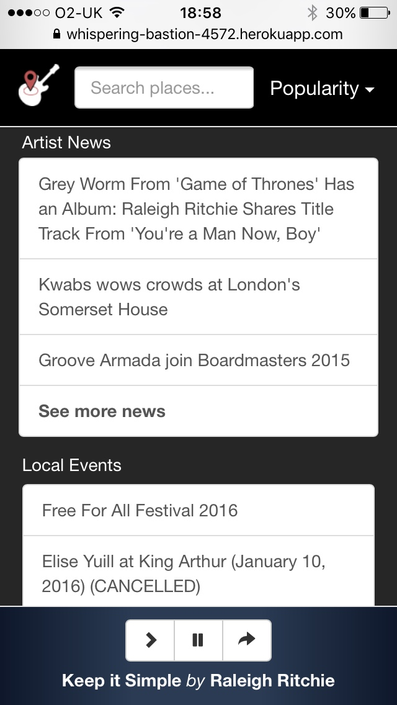
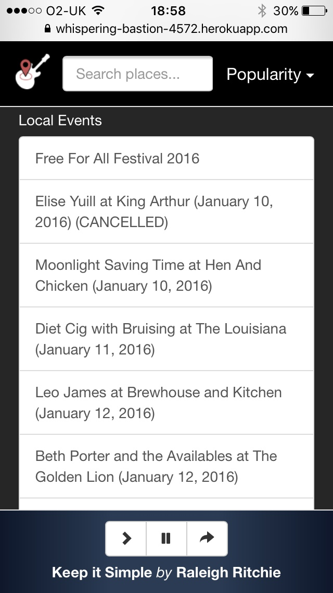

# A Music/Location Discovery Application



This web app was written by a team of 4 Makers Academy students for our final project.
The app is designed to help the user discover music from artists based in their current location or any location of their choice, and to find music performed in that location.
Alternatively, it could be used to understand a bit more about a location via the music that is produced or performed there. 
The local artists found can be filtered by their worldwide popularity. 


## Live demo
https://bands-near-u.herokuapp.com


## Duration
9 days


## Approach
We proceeded to build this app using the Agile methodologies we practise at Makers Academy. Twice (or three times) daily stand-ups, twice weekly retros and pair programming, rotating pairs twice a day. This way each one of us had some input in every facet of the app and we had a good understanding of what we were each doing at any given time.

As the application is location-based it was important to implement a responsively-designed UI. For this we used Bootstrap, re-organising the elements for smaller screens and hiding the brand name to make more room for the search bar (the brand logo remains in either case).

#### Project Working Document and User Stories
https://docs.google.com/document/d/16NNmJa4yp-4q5cYy07H9eRYgip4YFweZ9PlP4LGgvjY

#### First week Retrospective
https://docs.google.com/document/d/1PymRPDJkgK5D5HhTtilmV6tAKLntoazEezHT0CInLKI


## Installation

#### Deployment locally

* Install Node.js/NPM
* Clone this project
* ``` npm install ``` from within the project directory, then:
* ``` bower install ```
* ``` npm start ```
* navigate to http://localhost:5000

#### Deploying to Heroku 

assuming you have a Heroku account and Heroku Toolbelt installed:
* ``` heroku create <your app name> ```
* ``` git push heroku master ```
* ``` heroku open ```


## TODO

* Full code review
* Remove comments
* Refractor code
* Look at restructuring JS Promises
* Remove unused dependencies
* Comprehensive testing
* Improve search algorithm
* Improve compatibility between API's (ie. using different country codes)
* Better styling of modals
* Uniform styling of 'see more' links


## Technologies used

* JavaScript
* jQuery
* jPlayer (a jQuery plugin)
* HTML5
* CSS3
* Bootstrap
* Google Maps web API
* Google Maps JavaScript API
* Echo Nest API
* Spotify API
* Songkick API


## Screenshots



















## The Team
[Tom Barnes](https://github.com/forty9er) (Brighton, UK)

[Pablo Dominguez](https://github.com/blancopado) (Cádiz, Spain)

[Andy Dowell](https://github.com/k0zakinio) (Manchester, UK)

[Rob Youngman](https://github.com/youngmanr) (Bristol, UK)